# 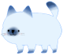 너에게 난

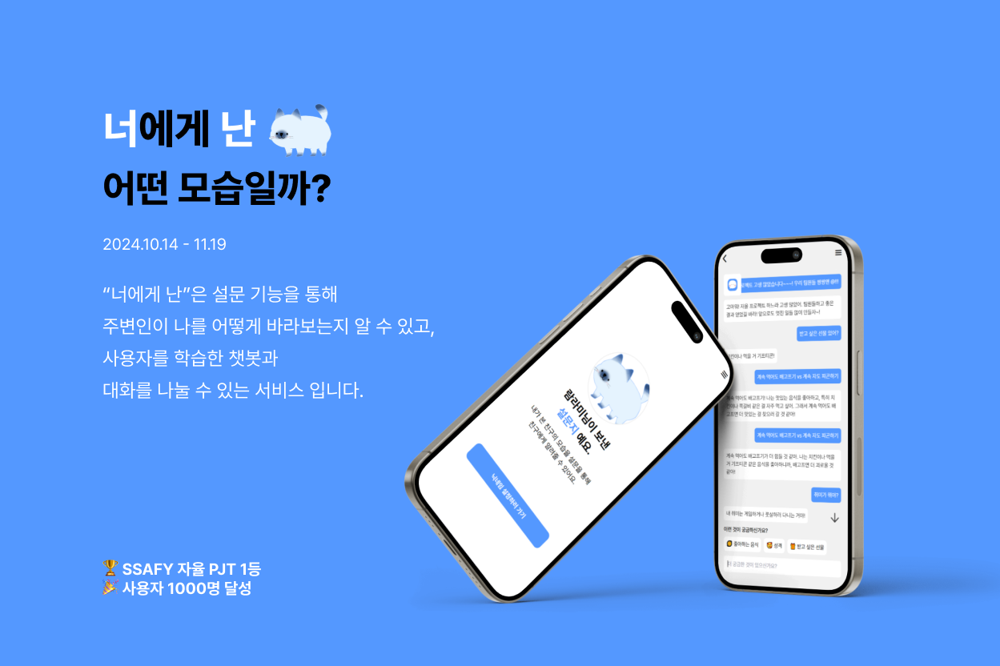

#  서비스 소개

### 프로젝트 기간

2024.10.14 - 11.19

### 개요:

“너에게 난”은 설문 기능을 통해
주변인이 나를 어떻게 바라보는지 알 수 있고,
사용자를 학습한 챗봇과
대화를 나눌 수 있는 서비스 입니다.

### 참여 인원

프론트 3명, 백엔드 2명, 인프라 1명

| 백하람 (프론트, 팀장)                                                                                      | 김범규 (프론트)                                                                                              | 조아름 (백엔드)                                                                                                 | 서근범 (프론트)                                                                                                   | 이건희 (백엔드)                                                                                                 | 전성권 (인프라)                                                                                                       |
|---------------------------------------------------------------------------------------------------------|-------------------------------------------------------------------------------------------------------|----------------------------------------------------------------------------------------------------------|------------------------------------------------------------------------------------------------------------|----------------------------------------------------------------------------------------------------------|----------------------------------------------------------------------------------------------------------------|
|  |  |  |  |  |  |
| [@ramrami-B](https://github.com/ramrami-B)                                                              | [@KBG1](https://github.com/KBG1)                                                                    | [@joareum](https://github.com/joareum)                                                                | [@Geunbeom](https://github.com/Geunbeom)                                                                     | [@GeonHui2](https://github.com/GeonHui2)                                                                 | [@JeonSungGwon](https://github.com/JeonSungGwon)                                                                   |

#  성과

### SSAFY 자율 PJT 1위 🏆
### 회원 가입 수, 응답자 수 포함 사용자 수 1000명 달성 🎉

#  기술 스택
### Frontend

### Backend

## Database

## Infrastructure

#  서비스 화면

### 로그인, 회원가입

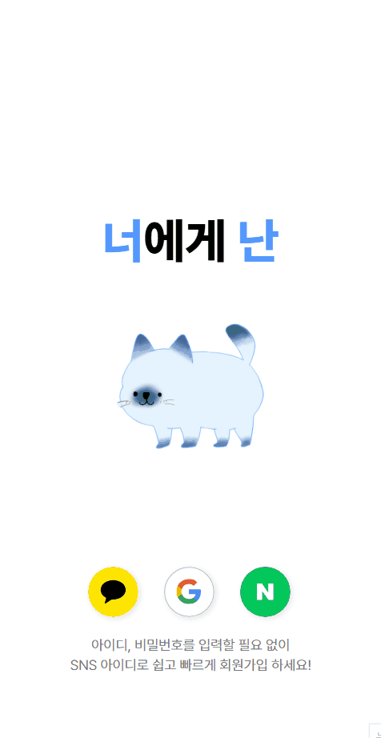

### 설문 생성 & 초대장

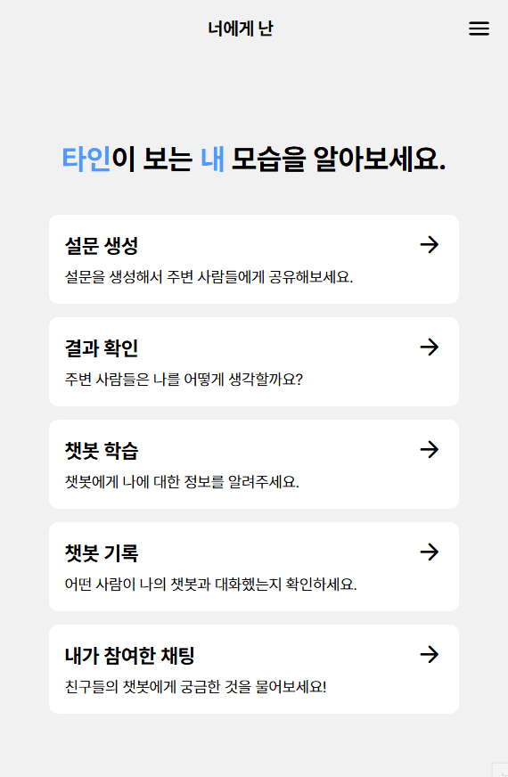
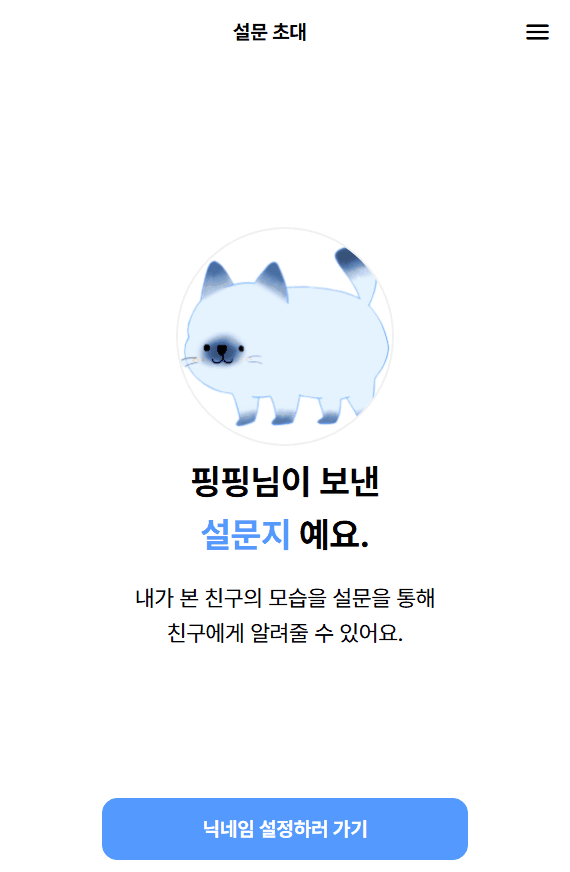

### 친구가 보낸 설문에 응답하기

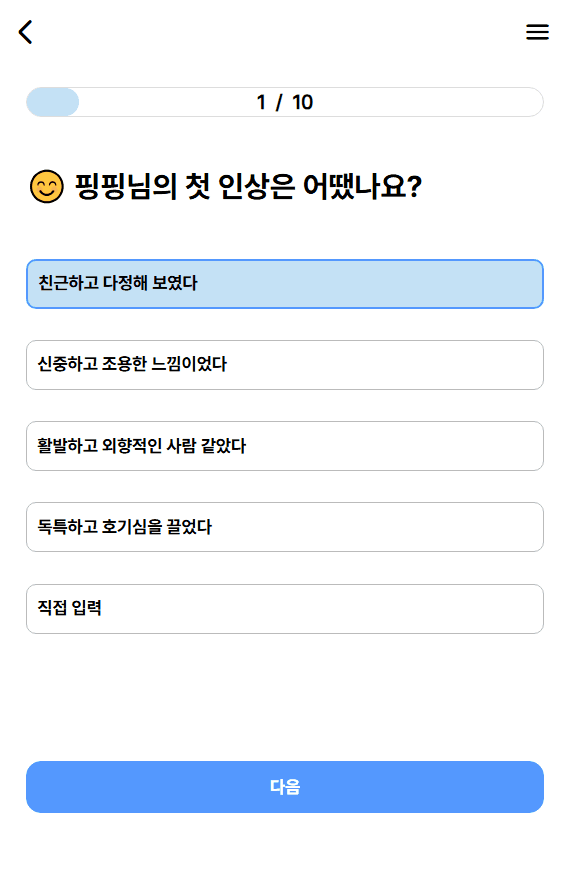

### 설문 결과 보기

### 챗봇 학습 (30문 30답)

### 닉네임 검색 (친구 찾기)

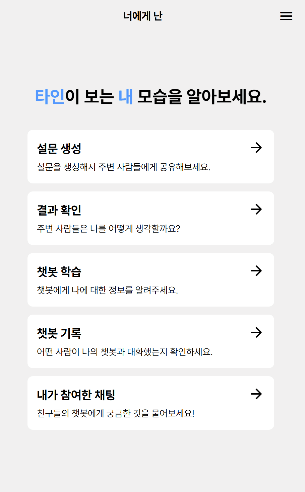

### 챗봇과 대화하기

    <h4>1. 챗봇이 대답 할 수 있는 질문</h4>
    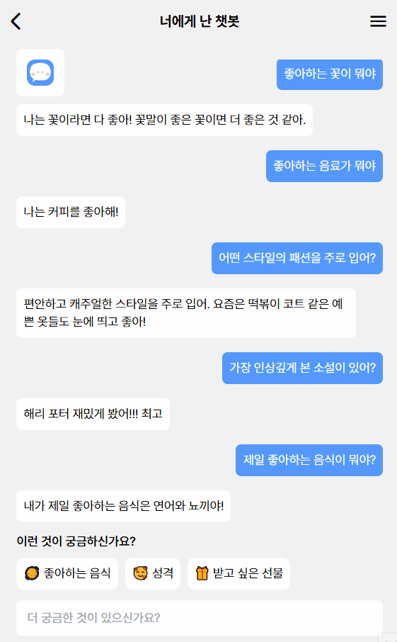

    <h4>2. 챗봇이 대답 할 수 없는 질문 - 다시 질문하기</h4>
    

    <h4>3. 챗봇이 대답 할 수 없는 질문 - 다른 질문하기</h4>
    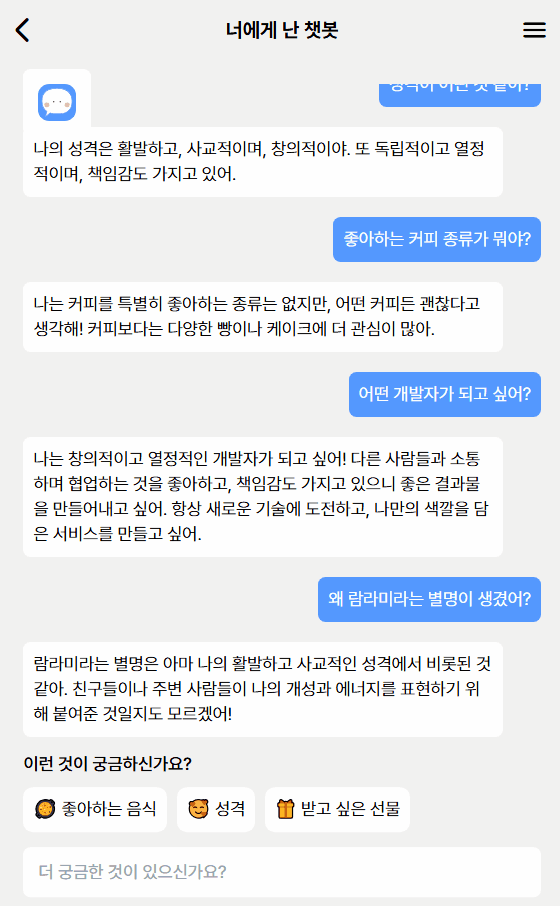

<h4>4. 챗봇이 대답 할 수 없는 질문 - 기다린다</h4>

### 나에게 온 채팅 기록 보기 & 챗봇 추가 학습

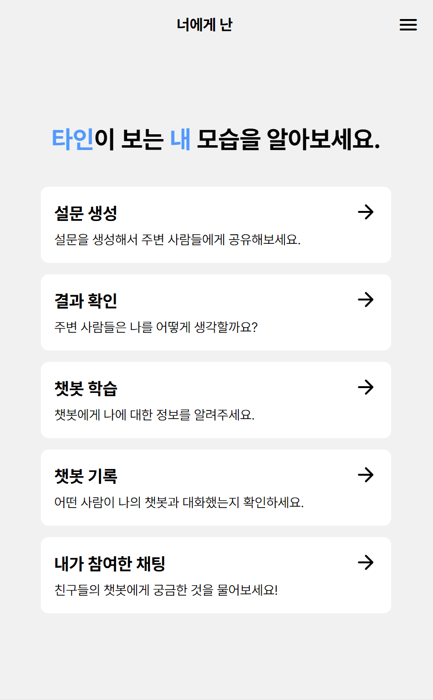

#  시스템 아키텍쳐

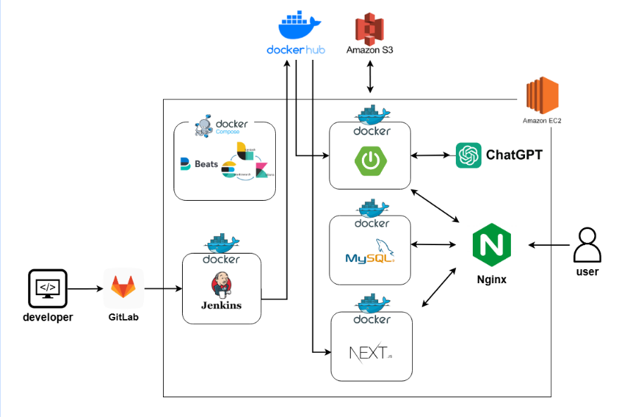
