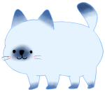
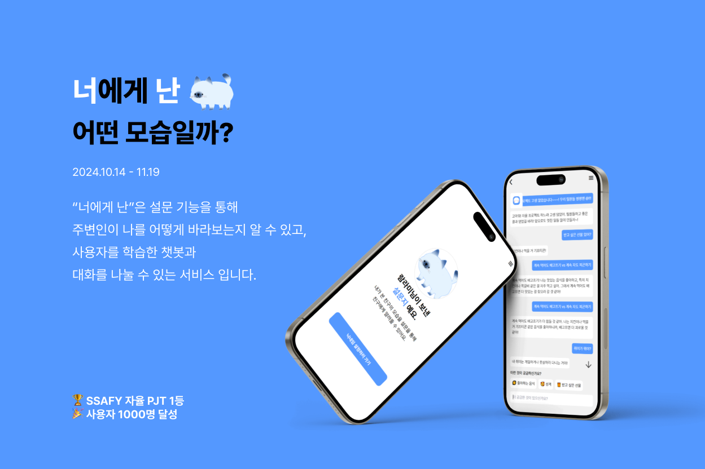

#  너에게 난 

#  서비스 소개 

### 프로젝트 기간

2024.10.14 - 11.19

### 개요: 

“너에게 난”은 설문 기능을 통해
주변인이 나를 어떻게 바라보는지 알 수 있고,
사용자를 학습한 챗봇과
대화를 나눌 수 있는 서비스 입니다.

### 참여 인원

프론트 3명, 백엔드 2명, 인프라 1명

#  성과

#### SSAFY 자율 PJT 1위 🏆
#### 회원 가입 수, 응답자 수 포함 사용자 수 1000명 달성 🎉